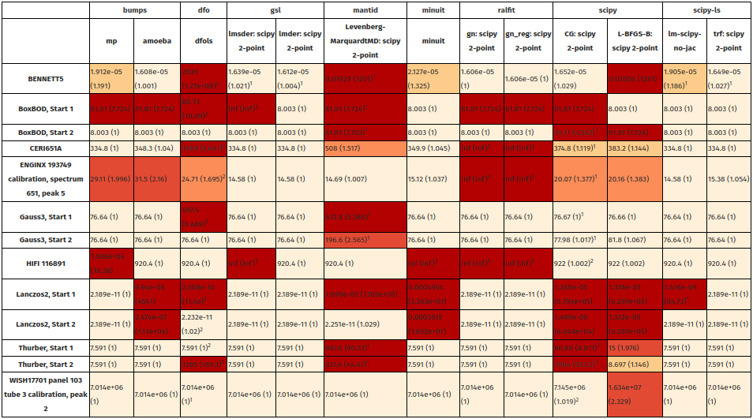

# FitBenchmarking
FitBenchmarking is a tool for comparing different minimizers/fitting software based on their accuracy and runtimes. For further documentation on FitBenchmarking see also [Wiki](https://github.com/fitbenchmarking/fitbenchmarking/wiki).

## Quick Start
 is (currently) the Python version needed for running/installing FitBenchmarking. Instructions for setting up python are available [here](https://github.com/mantidproject/fitbenchmarking/wiki/Setting-up-Python).

For help on how to use the command line/terminal, click the hyperlink corresponding to your operating system: 
[Windows](https://red-dot-geek.com/basic-windows-command-prompt-commands/),
[macOS](http://newsourcemedia.com/blog/basic-terminal-commands/) and
[Ubuntu](https://hackingpress.com/basic-linux-commands/)

### Installing

1. Download this repository or clone it using [git](https://git-scm.com/): \
    `git clone https://github.com/fitbenchmarking/fitbenchmarking.git`
2. Open up a terminal (command prompt) and go into the `fitbenchmarking` directory.
3. Once you are in the right directory, start the install with:\
    `python setup.py install --user`

You should now have all you need to use FitBenchmarking.
To try it out, you can run one of the example scripts as below.

## FitBenchmarking
The `example_scripts/example_runScripts.py` file is designed to benchmark minimizers supported by software/libraries that provide straightforward cross-platform Python install; as of now this means SciPy and SasView (more details provided in the file itself).

The required software packages should have already been installed in step 3 above (scipy, numpy, lxml, bumps, sasmodels).
If you have issues with any of these please contact us so that we can update the installer.

Try it out with:
  `python example_scripts/example_runScripts.py`

## FitBenchmarking Mantid
FitBenchmarking also works with [Mantid](https://www.mantidproject.org/Main_Page), however this is not installed by default.
To enable using Mantid, you should install it as follows:

#### Linux ####
Install mantid with:
    `python setup.py externals -s mantid`
#### Mac/Windows ####
Follow the instructions on the Mantid download page, found [here](https://download.mantidproject.org).

To test the installation, you can run the example script for Mantid `example_scripts/example_runScript_mantid.py`, located in the fitbenchmarking folder.
This example script fit benchmarks Mantid using all the available minimizers.
The resulting tables can be found in `example_scripts/results`.

## Description
The tool creates a table/tables that shows a comparison between the different minimizers available in a fitting software (e.g. SciPy or Mantid), based on their accuracy and/or runtimes.
An example of one of the results tables is:

This is the result of fitbenchmarking Mantid on a set of neutron data.
The results are normalised with respect to the best minimizer per problem.
The problem names link to html pages that display plots of the data and the fit that was performed, together with initial and final values of the parameters.
Here is an example of the final plot fit.

## Currently Benchmarking

